## cardinality

| Pertemuan 11  |  Pemrograman Berorientasi Objek  
|-------|---------
| NIM   | 312310632
| Nama  | FAKHRI AFIF
| Kelas | TI.23.A6

## Latihan

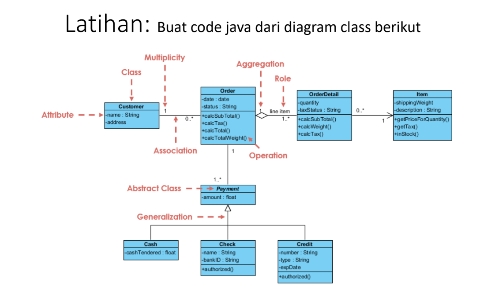

## Penjelasan

### 1. Customer Class

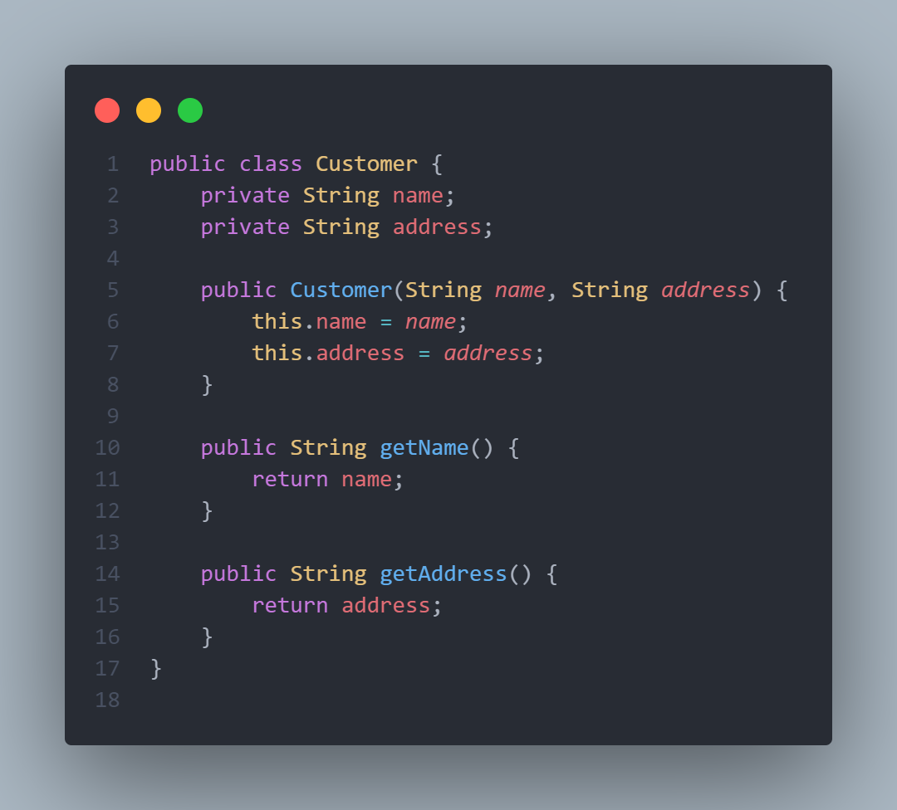

Fungsi Utama: Kelas ini merepresentasikan seorang pelanggan (Customer) yang memiliki nama dan alamat.

Atribut:
- name: Menyimpan nama pelanggan.
- address: Menyimpan alamat pelanggan.
  
Metode:

- Customer(String name, String address): Konstruktor untuk membuat objek Customer dengan nama dan alamat.
- getName(): Mengembalikan nama pelanggan.
- getAddress(): Mengembalikan alamat pelanggan.

- contoh penggunaan 
  ```Customer customer = new Customer("Fakhri Afif", "Balikpapan");```


### 2. Item Class

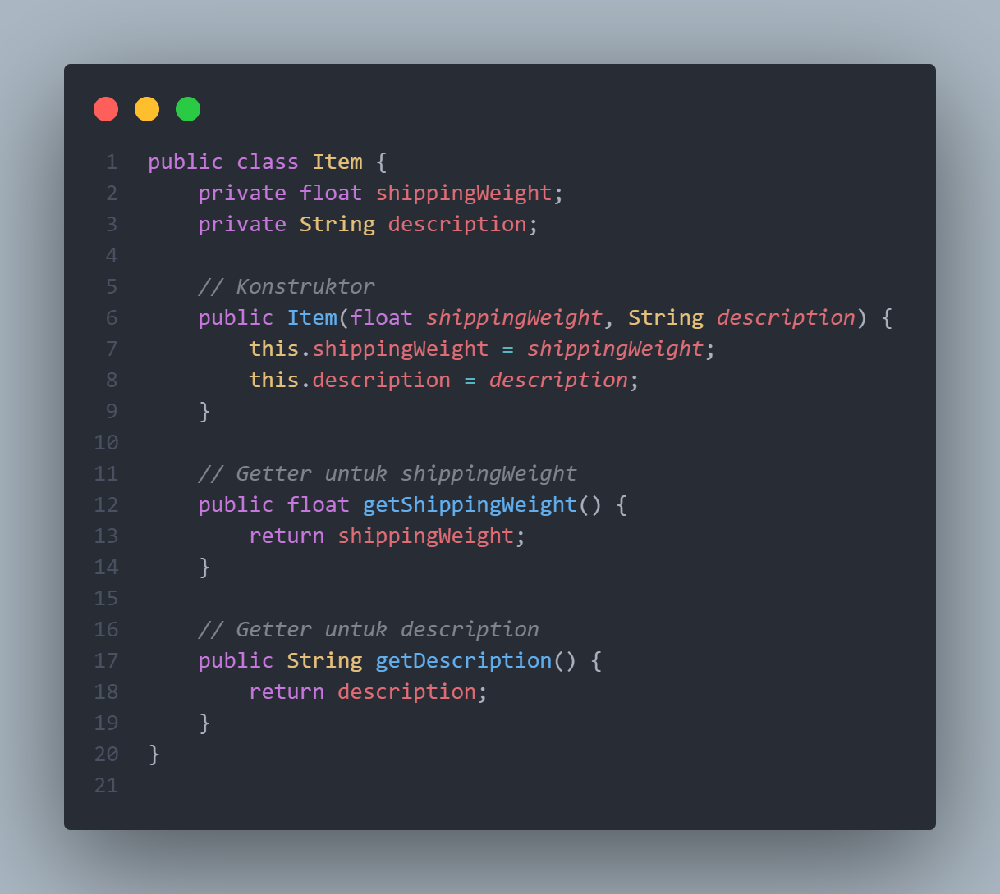

Fungsi Utama: Mewakili produk atau barang yang akan dibeli oleh pelanggan.

Atribut:
- shippingWeight: Berat barang (digunakan untuk menghitung ongkir).
- description: Deskripsi barang.
  
Metode:

- Item(float shippingWeight, String description): Konstruktor untuk membuat item.
- getShippingWeight(): Mengembalikan berat barang.
- getDescription(): Mengembalikan deskripsi barang.
- getPriceForQuantity(int quantity): Menghitung harga berdasarkan kuantitas barang.
- inStock(): Mengecek apakah barang tersedia dalam stok (simulasi).

- contoh penggunaan 
 ``` Item item = new Item(2.5f, "Laptop");```

### 3. Order Class
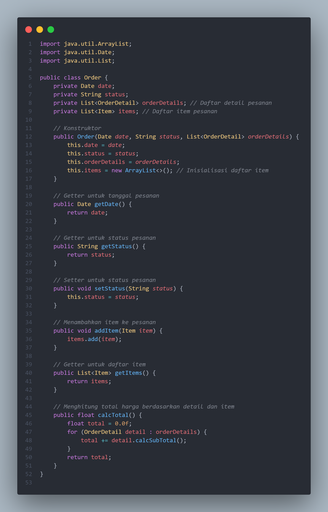

Fungsi Utama: Merepresentasikan pesanan pelanggan, termasuk detail pesanan, status, dan total harga.

Atribut:

- date: Tanggal pesanan dibuat.
- status: Status pesanan (contoh: Pending, Completed).
- orderDetails: Daftar detail pesanan.
  
Metode:

- Order(Date date, String status, List<OrderDetail> orderDetails): Konstruktor untuk membuat pesanan baru.
- getDate(): Mengembalikan tanggal pesanan.
- getStatus(): Mengembalikan status pesanan.
- setStatus(String status): Mengubah status pesanan.
- calcTotal(): Menghitung total harga dari semua item dalam pesanan.
  
- contoh penggunaan
``` Order order = new Order(new Date(), "Pending", orderDetails);```

### 4. OrderDetail
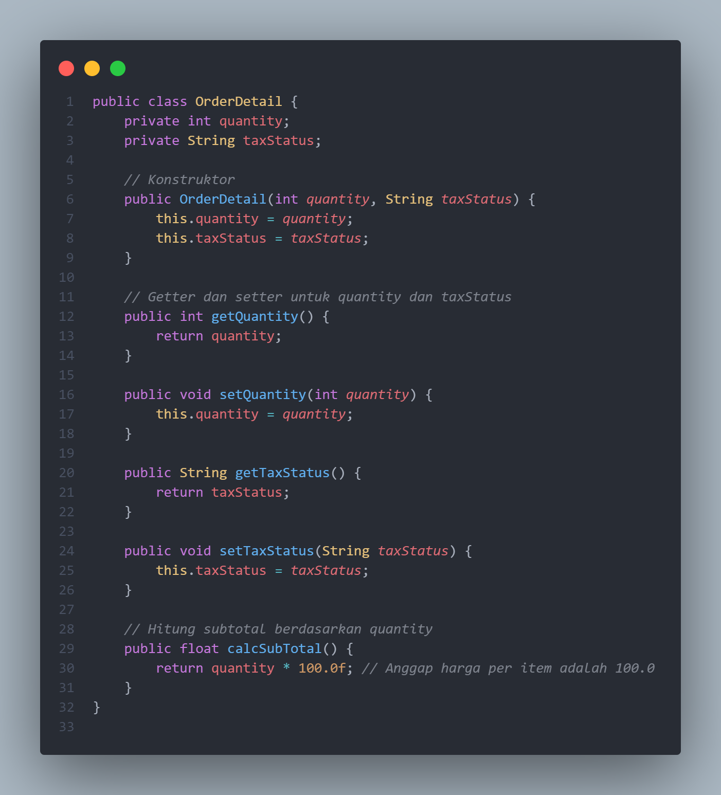

Fungsi Utama: Menyimpan detail dari setiap item dalam pesanan, seperti kuantitas dan status pajak.

Atribut:

- quantity: Jumlah item yang dipesan.
- taxStatus: Status pajak (contoh: Taxable, Non-Taxable).
  
Metode:

- OrderDetail(int quantity, String taxStatus): Konstruktor untuk membuat detail pesanan.
- calcSubTotal(): Menghitung subtotal harga untuk kuantitas item.
- calcWeight(Item item): Menghitung total berat dari semua item dalam pesanan.
- calcTax(): Menghitung pajak dari subtotal.
- contoh penggunaan ```OrderDetail orderDetail = new OrderDetail(2, "Taxable");```


### 5. Payment (Abstract Class)

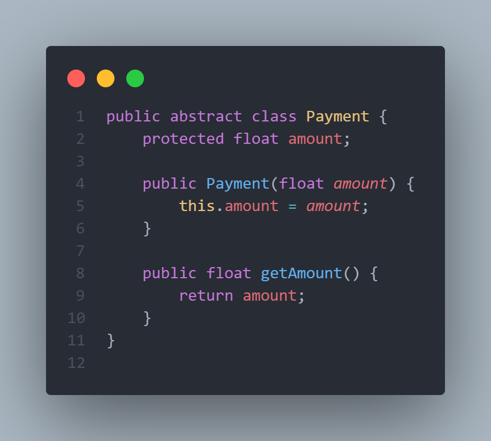

Fungsi Utama: Menjadi dasar untuk semua jenis pembayaran, seperti Cash, Check, dan Credit.

Atribut:

- amount: Jumlah uang yang dibayarkan.
  
Metode:

- Payment(float amount): Konstruktor untuk inisialisasi pembayaran.
- Catatan: Kelas ini tidak bisa dibuat objek langsung karena bersifat abstrak..

### 6. Cash Class

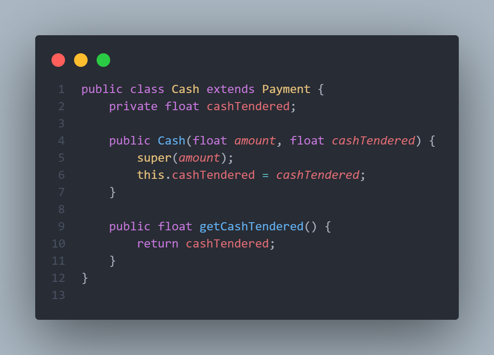

Fungsi Utama: Merepresentasikan pembayaran menggunakan uang tunai, turunan dari Payment.

Atribut:

- cashTendered: Jumlah uang tunai yang diberikan pelanggan.
Metode:

- Cash(float amount, float cashTendered): Konstruktor untuk membuat pembayaran tunai.
- getCashTendered(): Mengembalikan jumlah uang tunai yang diterima.
- contoh penggunaan ``` Cash cash = new Cash(1000.0f, 1500.0f);```

### 7. Check Class

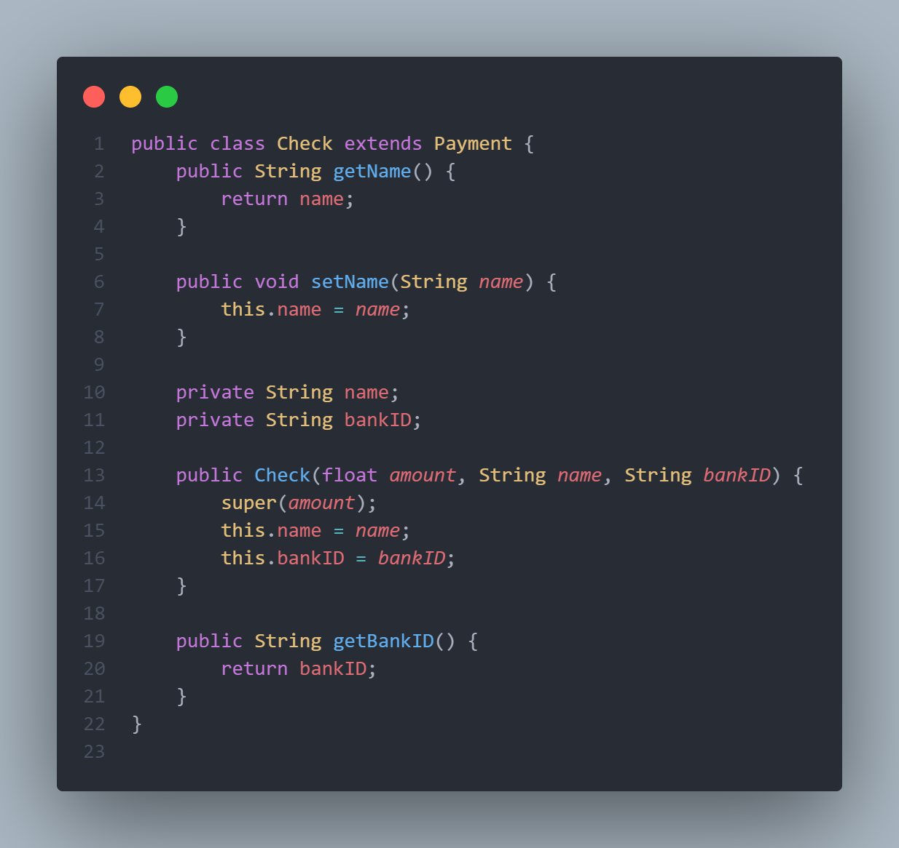

Fungsi Utama: Merepresentasikan pembayaran menggunakan cek, turunan dari Payment.

Atribut:

- name: Nama pelanggan.
- bankID: ID bank pelanggan.
  
Metode:

- Check(float amount, String name, String bankID): Konstruktor untuk membuat pembayaran dengan cek.
- getBankID(): Mengembalikan ID bank.
- contoh penggunaan```Check check = new Check(1000.0f, "Fakhri", "***********987"); ```

### 9. Credit Class

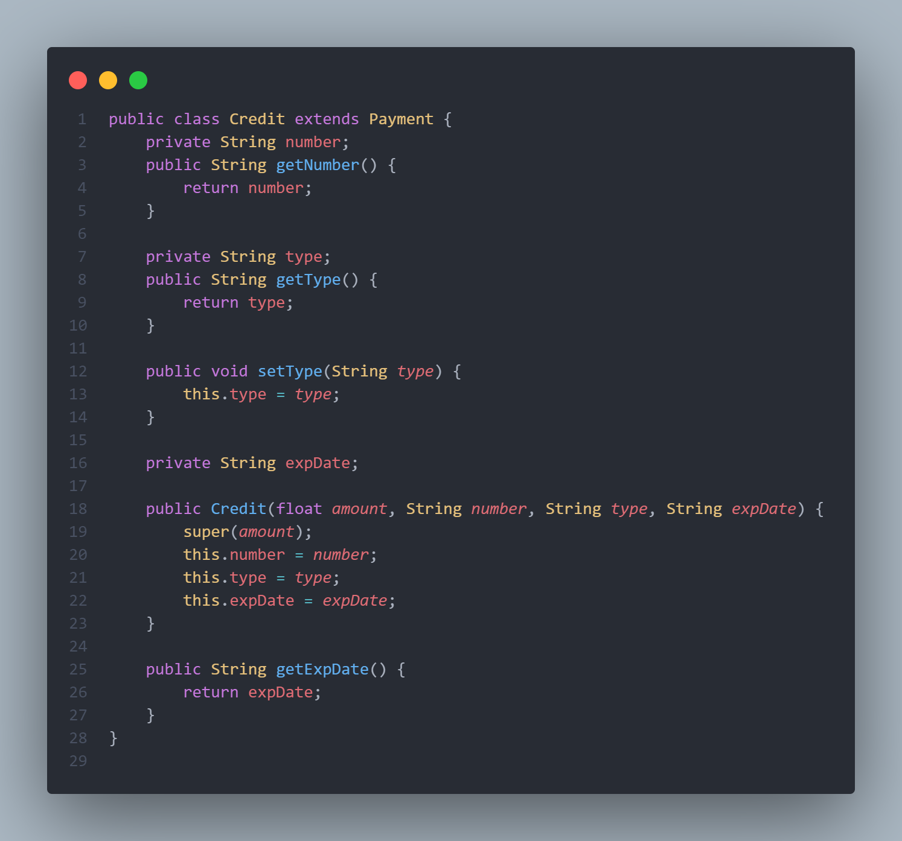

Fungsi Utama: Mewakili pembayaran menggunakan kartu kredit, sebagai turunan dari kelas abstrak Payment.

Atribut:

- number: Nomor kartu kredit.
- type: Jenis kartu kredit (contoh: Visa, MasterCard).
- expDate: Tanggal kedaluwarsa kartu kredit.
  
Metode:

- Credit(float amount, String number, String type, String expDate): Konstruktor untuk membuat pembayaran dengan kartu kredit.
- getExpDate(): Mengembalikan tanggal kedaluwarsa kartu kredit.
- contoh penggunaan ``` Credit credit = new Credit(1000.0f, "1234567890123456", "Visa", "2024-08-18"); ```

### 10. Main Class

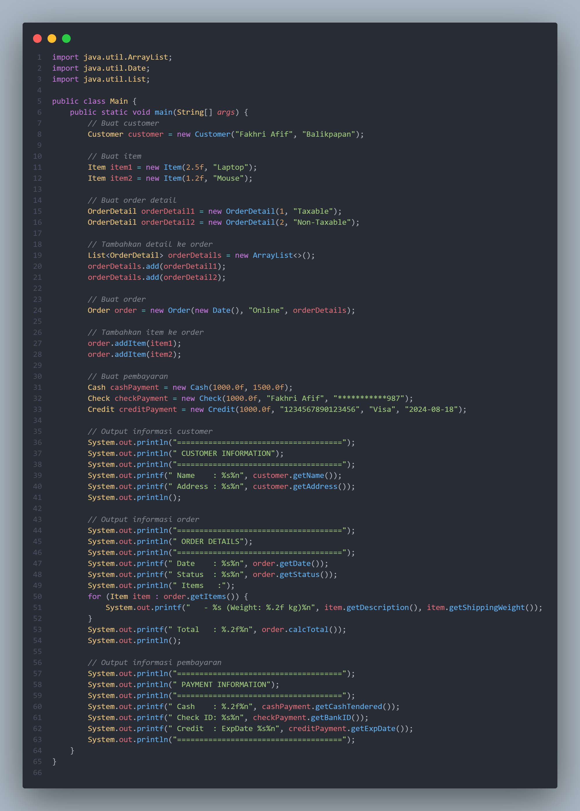

**Tujuan Program**

Program ini bertujuan untuk:

1. Membuat dan mengelola data pelanggan.
2. Membuat daftar item yang dipesan beserta detail pesanan.
3. Menghubungkan pesanan dengan berbagai metode pembayaran (Cash, Check, dan Credit).
4. Menampilkan informasi secara terformat, mencakup:
   - Informasi pelanggan.
   - Detail pesanan (tanggal, status, item yang dipesan).
   - Detail pembayaran.
     
Proses:

**Pembuatan Pelanggan:** Membuat objek Customer dengan nama "Fakhri Afif" dan alamat "Balikpapan".

**Pembuatan Item:** Membuat dua objek Item:

- Laptop (berat 2.50 kg).
- Mouse (berat 1.20 kg).
  
**Detail Pesanan:** Membuat objek OrderDetail untuk memberikan informasi tambahan seperti Taxable dan Non-Taxable.

**Pengelolaan Pesanan:**

- Membuat objek Order yang menyimpan informasi tanggal, status Online, dan daftar item.
- Menambahkan item ke dalam pesanan.
  
**Pengelolaan Pembayaran:**

- Membuat tiga metode pembayaran.
- Cash: Membayar dengan tunai.
- Check: Membayar dengan cek.
- Credit: Membayar dengan kartu kredit.

**Tampilan Informasi:**

- Menampilkan nama pelanggan, detail pesanan (tanggal, status, item, total), dan metode pembayaran dalam format yang rapi.

### Output yang dihasilkan 
```
=====================================
 CUSTOMER INFORMATION
=====================================
 Name    : Fakhri Afif
 Address : Balikpapan

=====================================
 ORDER DETAILS
=====================================
 Date    : Sun Dec 01 00:00:00 UTC 2024
 Status  : Online
 Items   :
   - Laptop (Weight: 2.50 kg)
   - Mouse (Weight: 1.20 kg)
 Total   : 200.00

=====================================
 PAYMENT INFORMATION
=====================================
 Cash    : 1500.00
 Check ID: ***********987
 Credit  : ExpDate 2024-08-18
=====================================


```
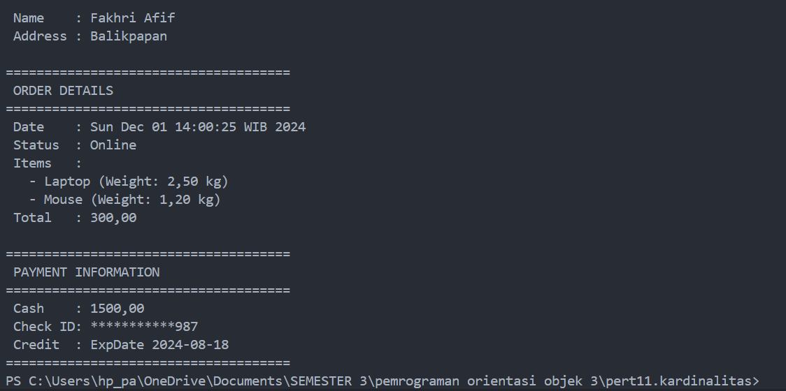

Output program mencerminkan informasi lengkap dari proses transaksi, yang meliputi:

**Informasi Pelanggan:**

- Nama pelanggan (Fakhri Afif) dan alamatnya (Balikpapan).

**Detail Pesanan:**

- Tanggal pesanan dibuat.
- Status pesanan (Online).
- Total biaya pesanan dihitung berdasarkan detail yang diberikan.
  
**Informasi Pembayaran:**

- Pembayaran dilakukan dengan tiga metode:
- Tunai (Cash): Jumlah uang tunai yang diserahkan (Rp 1500,00).
- Cek (Check): Identitas bank terkait cek (***********987).
- Kartu Kredit (Credit): Informasi kedaluwarsa kartu (2024-08-18).
  
### Kesimpulannya
output ini menunjukkan data yang terstruktur mulai dari pelanggan, detail pesanan, hingga metode pembayaran, yang mencerminkan alur transaksi yang jelas dan terorganisir.


# Selesai
